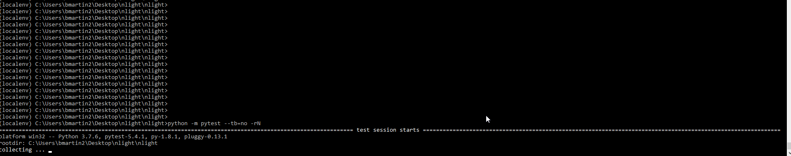

# nlight

## Usage:
Clone or download the project and navigate to the "nlight" directory.
- To run the evaluator program run `python -m evaluator 1+1`
- To run the tests you will need to install dependencies. You can do so by running `pip install dist\evaluator-0.0.0-py3-none-any.whl`
- Tests can be run with `python -m pytest`

## The Technical Problem

### Write a program to evaluate arithmetic expressions.  Input will be text expression strings.  Here are some examples:
- 5 + 14
- (8 + 2) * 4
- 7 + 3 + 9
- (6 + 5) * (8 + 2)

### Your solution should:
- Demonstrate the ability to parse/evaluate arithmetic expressions
- Support addition and multiplication and be easily extensible to add other operations later
- Be designed and implemented in an object-oriented manner
- Not use the "Shunting Yard" algorithm
- Contain a testing framework to validate that the solution is functioning as desired
- Use whatever tools and languages you are most comfortable with

## References Used to develop soluton
[Shunting-Yard vs Precedence-Climbing](http://www.engr.mun.ca/~theo/Misc/exp_parsing.htm)

[Recursive-Descent](https://rockie-yang.gitbooks.io/python-cookbook/ch2/simple_parser.html)

[Generating Arithmetic Expressions](https://stackoverflow.com/questions/6881170/is-there-a-way-to-autogenerate-valid-arithmetic-expressions)

## Testing
generator.py contains methods for generating different test inputs and writing to file. There are also methods to generate truth data for a corresponding expression using the 'calc' command line utility.

The test/ directory contains test input files containing generated expressions for different testcases and the corresponding truth data.

pytest is used as the testing framework and runs against the test_*.py files in the test/ directory.

### Example output

